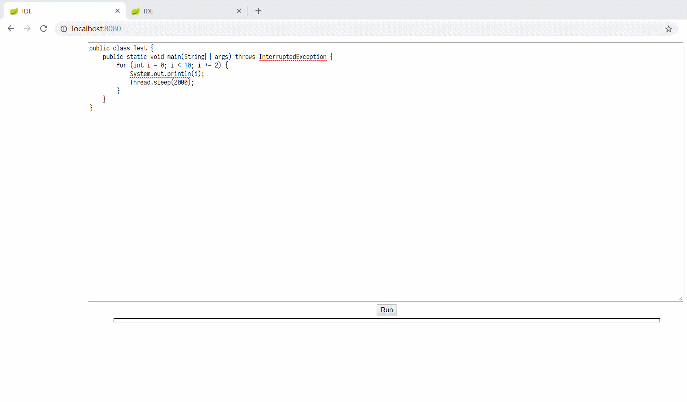
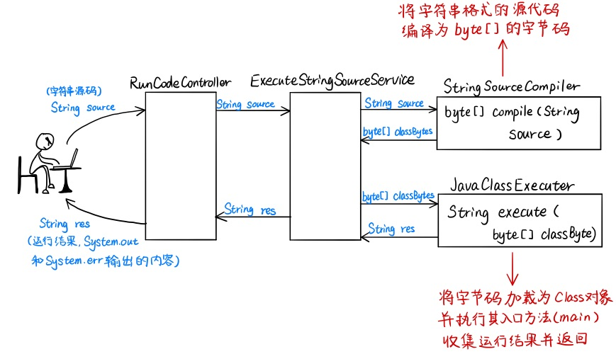

# 基于 SpringBoot 的在线 Java IDE

本项目基于 SpringBoot 实现了一个在线的 Java IDE，可以远程运行客户端发来的 Java 代码的 main 方法，并将程序的标准输出内容反馈给客户端。

**运行效果如下：**

**使用技术：**

- Java 动态编译
- Java 类加载器
- Java 反射
- Java 类文件的结构
- 如何将一个类变为线程安全类

综上所述，本项目是一个非常适合展示 Java 基础的掌握程度的项目（带虚拟机和并发问题那种），可以在比较注重基础的面试中展示自己的基础水平。

## 项目实现流程

在线执行 Java 代码的实现流程如下图所示：

通过观察上图可以发现，我们的重点在于实现 `StringSourceCompiler` 和 `JavaClassExecuter` 两个类。它们的作用分别为：

- `StringSourceCompiler`：将字符串形式的源代码 String source 编译成字节码 byte[] classBytes；
- `JavaClassExecuter`：将字节码 byte[] classBytes 加载进 JVM，执行其入口方法，并收集运行输出结果字符串返回。

> **Note：** 我们只收集 `System.out` 和 `System.err` 输出的内容返回给客户端。

## 实现编译模块

通过 JDK 1.6 后新加的动态编译实现 `StringSourceCompiler`，使用动态编译，可以直接在内存中将源代码字符串编译为字节码的字节数组，这样既不会污染环境，又不会额外的引入 IO 操作，一举两得。

具体实现以及原理说明详见：[动态编译](./doc/01-动态编译.md)

## 实现运行模块

`JavaClassExecuter` 的实现分为以下两步：

- [执行字节码的入口方法（main 方法）](./doc/02-执行字节码的入口方法.md)
- [收集代码执行结果](./doc/03-收集代码执行结果.md)

## 解决并发结果收集问题

